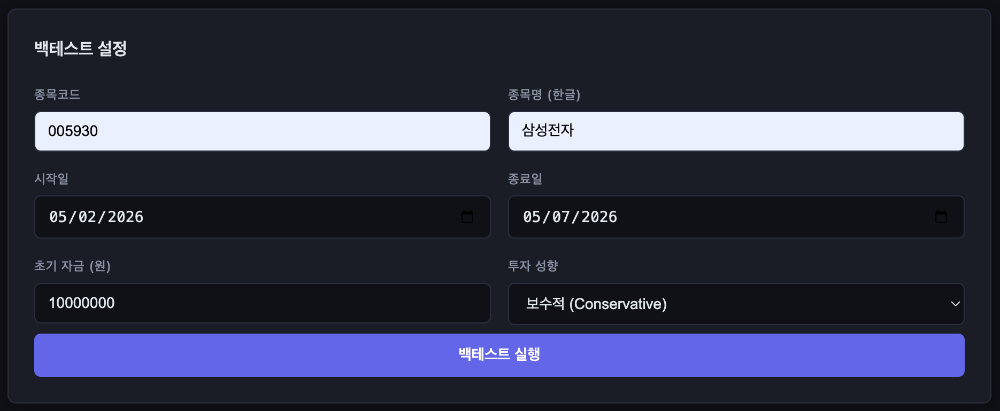
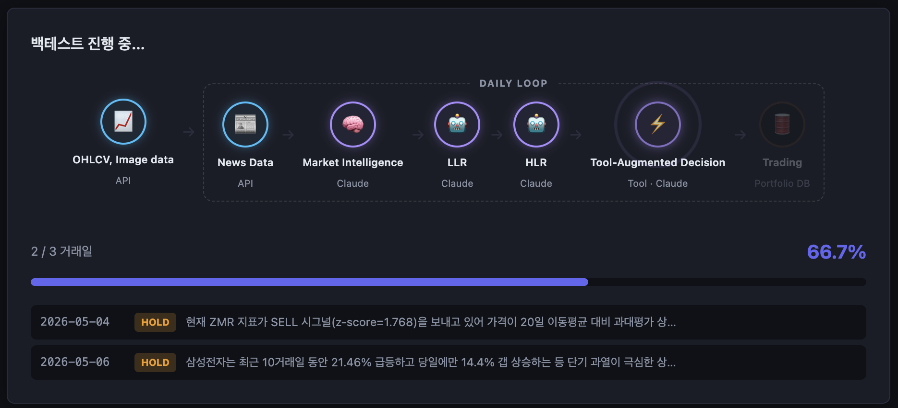
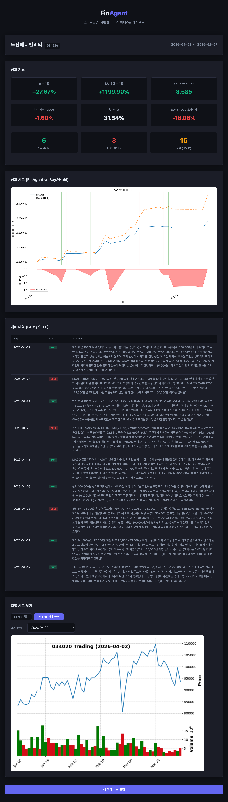

# FinAgent

**A Multimodal Foundation Agent for Financial Trading**

A multimodal LLM trading agent based on the paper [arxiv 2402.18485](https://arxiv.org/abs/2402.18485).  
A backtesting pipeline combining news and price data analysis, candlestick chart Vision reflection, memory-based learning, and technical indicator injection.


[](https://github.com/effective-p/FinAgent/stargazers)
[](https://github.com/effective-p/FinAgent/network/members)
[](https://github.com/effective-p/FinAgent/graphs/contributors)
[](LICENSE)


---

## Architecture

```
DataFetcher → MarketIntelligence → LowLevelReflection → HighLevelReflection → DecisionMaking → Portfolio
                      ↕                     ↕                      ↕
                            MemoryStore (ChromaDB, 3 collections)
```

| Module | Role |
|------|------|
| `DataFetcher` | pykrx price data, Google News RSS, mplfinance chart generation |
| `MemoryStore` | ChromaDB 3-collection (MI / LLR / HLR), Diversified Retrieval |
| `MarketIntelligenceModule` | Claude analysis of latest news+prices, short/medium/long-term query generation |
| `LowLevelReflectionModule` | Kline chart Vision + price change analysis → short/medium/long-term cause analysis |
| `HighLevelReflectionModule` | Trading chart Vision + past actions → decision evaluation & improvement |
| `DecisionMakingModule` | Comprehensive analysis + technical indicators (MACD/KDJ/ZMR) → BUY/SELL/HOLD |
| `Portfolio` | SQLite trade history, position/cash management |
| `metrics` | Equity curve, Sharpe ratio, MDD, Buy&Hold benchmark |

---

## Installation

### Create Environment (conda recommended)

```bash
conda env create -f environment.yml
conda activate finagent
```

### Or pip

```bash
conda create -n finagent python=3.12 -y
conda activate finagent
pip install -r requirements.txt
```

> `pandas_ta` 0.4.x requires Python 3.12 or higher.

### Environment Variables

```bash
export ANTHROPIC_API_KEY="sk-ant-..."
```

---

## Run Modes

FinAgent supports two run modes. It is recommended to run within the virtual environment created above.

---

### Mode 1 — CLI (Direct Terminal Execution)

```bash
python finagent/main.py \
  --symbol 005930 \
  --stock-name 삼성전자 \
  --start 2024-01-02 \
  --end 2024-03-29 \
  --initial-cash 10000000 \
  --preference moderate
```

| Option | Default | Description |
|------|--------|------|
| `--symbol` | Required | KRX stock code (e.g., `005930`) |
| `--stock-name` | Required | Korean stock name (for news search, e.g., `삼성전자`) |
| `--start` | Required | Start date `YYYY-MM-DD` |
| `--end` | Required | End date `YYYY-MM-DD` |
| `--initial-cash` | `10000000` | Initial capital (KRW) |
| `--preference` | `moderate` | Trader preference `aggressive` / `moderate` / `conservative` |
| `--db-path` | `portfolio.db` | SQLite file path |
| `--memory-dir` | `memory_db` | ChromaDB storage directory |
| `--chart-dir` | `charts` | Chart image storage directory |

#### Example Output

```
====================================================
  Backtesting Result: 005930 [삼성전자]  (2024-01-02 ~ 2024-03-29)
====================================================
  Final Portfolio Value:      11,234,567 KRW
  Total Return:                   +12.35%
  Annualized Return:              +52.18%
  Sharpe Ratio:                    1.234
  Max Drawdown (MDD):              -5.67%
  Annual Volatility:              18.45%
----------------------------------------------------
  Buy & Hold Return:               +8.90%
  Excess Return:                   +3.45%
----------------------------------------------------
  Buy count:                           5
  Sell count:                          4
  Hold count:                         58
  Performance chart: charts/performance_005930_....png
====================================================
```
---

### Mode 2 — Web UI (Browser-based)

Handles everything in the browser, from backtest parameter input to real-time progress monitoring and result visualization.

```bash
# Start server
export ANTHROPIC_API_KEY=sk-ant-...
python run_web.py
```

Access `http://localhost:8000` in your browser.

#### Features

| Step | Description |
|------|------|
| **Form Input** | Set stock code, stock name, period, initial capital, and trader preference |
| **Real-time Progress** | Progress bar update per trading day + BUY/SELL/HOLD log streaming |
| **Result Dashboard** | KPI cards, performance chart, trade history table, daily chart browser |

##### Form Input


##### Real-time Progress


##### Result Dashboard


#### How it Works

- Backtests run in a background thread, with progress streamed in real-time via **SSE (Server-Sent Events)**.
- Missed events are automatically replayed even if you close and reopen the browser tab.
- Each backtest run is stored independently under `job_data/{job_id}/` (preventing SQLite·ChromaDB conflicts).

> **Note**: `workers=1` is fixed (using in-process job store). Running multiple backtests simultaneously results in sequential processing.

---

## Full Pipeline

### Daily Execution Flow

The following 6 steps run in order for each trading day.

```
┌─────────────────────────────────────────────────────────────────────┐
│  run_day(symbol, target_date, price_df, ...)                        │
│                                                                     │
│  1. Data Collection                                                 │
│     ├─ pykrx          → price_df (OHLCV, look-ahead blocked)        │
│     ├─ Google RSS     → news_list (±7 day filter)                   │
│     ├─ mplfinance     → kline_chart.png   (for LLR)                 │
│     └─ mplfinance     → trading_chart.png (for HLR, BUY▲/SELL▽ markers) │
│                                                                     │
│  2. Market Intelligence (Claude API)                                │
│     ├─ Input: news_list + price_df                                  │
│     ├─ Output: summary + short/medium/long_term_query               │
│     ├─ Diversified Retrieval: 3 queries → up to 6 past MI records   │
│     └─ Store: memory["market_intelligence"]                         │
│                                                                     │
│  3. Low-Level Reflection (Claude Vision)                            │
│     ├─ Input: kline_chart.png + price change rates (1d/5d/10d/20d) + MI summary │
│     ├─ Output: short/medium/long-term price movement cause analysis + query │
│     └─ Store: memory["low_level_reflection"]                        │
│                                                                     │
│  4. High-Level Reflection (Claude Vision)                           │
│     ├─ Input: trading_chart.png + recent 14 trade history + MI + LLR │
│     ├─ Output: decision evaluation + improvement plan + summary + query │
│     └─ Store: memory["high_level_reflection"]                       │
│                                                                     │
│  5. Decision Making (Claude API)                                    │
│     ├─ Input: MI + LLR + HLR + technical indicators (MACD/KDJ/ZMR) + portfolio │
│     └─ Output: BUY / SELL / HOLD + reasoning                       │
│                                                                     │
│  6. Trade Execution                                                 │
│     └─ Portfolio.execute() → SQLite record                          │
└─────────────────────────────────────────────────────────────────────┘
```

---

### Data Flow Between Modules

```
price_df ──┬──────────────────────────────────────────────────────────────────┐
           │                                                                  │
           ▼                                                                  │
     DataFetcher                                                              │
      ├─ news_list ──────────────────────┐                                    │
      ├─ kline_chart.png ────────────────┼──────────┐                         │
      └─ trading_chart.png ─────────────┼───────────┼───────────┐             │
                                        │           │           │             │
                                        ▼           │           │             │
                              MarketIntelligence    │           │             │
                                ├─ latest_summary ──┼───────────┼─────────────┼──┐
                                ├─ past_summary     │           │             │  │
                                └─ queries ─────────┼───────────┼─────────────┼──┤
                                                    │           │             │  │
                                        ┌───────────┘           │             │  │
                                        ▼                       │             │  │
                              LowLevelReflection                │             │  │
                                ├─ short_term_reasoning ────────┼─────────────┼──┤
                                ├─ medium_term_reasoning ───────┼─────────────┼──┤
                                ├─ long_term_reasoning ─────────┼─────────────┼──┤
                                └─ query ───────────────────────┼─────────────┼──┤
                                                                │             │  │
                                               ┌────────────────┘             │  │
                                               ▼                              │  │
                                     HighLevelReflection ◄── past_actions ◄───┘  │
                                       ├─ reasoning ──────────────────────────┐  │
                                       ├─ improvement ────────────────────────┤  │
                                       └─ query ──────────────────────────────┤  │
                                                                              │  │
                                                              ┌───────────────┘  │
                                                              ▼                  │
                                                      DecisionMaking ◄───────────┘
                                                        ├─ TechnicalSignals (computed internally)
                                                        └─ Decision (BUY/SELL/HOLD)
                                                                    │
                                                                    ▼
                                                              Portfolio.execute()
```

---

### Memory System Details

ChromaDB maintains 3 independent collections, with each module reading from and writing to only its own collection.

```
┌─────────────────────────────────────────────────────────────────────────────────┐
│  MemoryStore (ChromaDB + all-MiniLM-L6-v2 embeddings)                           │
│                                                                                 │
│  ┌─────────────────────┐  ┌──────────────────────┐  ┌─────────────────────────┐ │
│  │ market_intelligence │  │ low_level_reflection │  │  high_level_reflection  │ │
│  │                     │  │                      │  │                         │ │
│  │  Store: MI summary  │  │  Store: short+medium │  │                         │ │
│  │  Meta: symbol, date,│  │  +long reasoning     │  │                         │ │
│  │  short/medium/long  │  │  combined text       │  │                         │ │
│  │  term_query         │  │  Meta: symbol, date  │  │     Store: summary      │ │
│  └─────────────────────┘  └──────────────────────┘  └─────────────────────────┘ │
│           ↑ ↓                      ↑ ↓                           ↑ ↓            │
│           MI                       LLR                           HLR            │
│ (Diversified Retrieval) (search via short_term_query) (reflection of previous)  │
└─────────────────────────────────────────────────────────────────────────────────┘
```

**Diversified Retrieval** — Core mechanism of MarketIntelligence:

```python
# 3 independent searches with short/medium/long-term queries → deduplicate → collect up to 6 past memories
past_docs = memory.diversified_retrieve(
    "market_intelligence",
    queries=[short_term_q, medium_term_q, long_term_q],
    top_k_each=2,
)
```

---

### Technical Signal Injection Flow

```
price_df
    │
    ▼
get_technical_signals(df)
    ├─ MACD (12/26/9)   → golden/dead cross detection → "BUY signal (golden cross, MACD=0.12)"
    ├─ KDJ + RSI        → overbought/oversold detection → "SELL signal (K=82, RSI=74, overbought)"
    └─ ZMR (z-score)    → deviation from MA20 detection → "HOLD (z-score=0.31, normal range)"
              │
              └─ signal_text (3-line combined)
                          │
                          ▼
              Injected directly into DecisionMaking prompt
```

---

### Backtesting Loop

```
run_backtest(symbol, start, end)
│
├─ Collect full period + lookback (90 days) at once
│  price_df = fetcher.get_price_data(lookback_days = (end-start).days + 90)
│
├─ Filter trading days
│  trading_days = price_df[(start ≤ index ≤ end)]
│
└─ for target_date in trading_days:
       try:
           run_day(...)          ← On exception, skip that day and continue
       except:
           logger.exception(...)
│
└─ Performance measurement
   ├─ compute_equity_curve(trades, price_df, initial_cash)
   ├─ compute_benchmark(price_df, initial_cash)    ← Buy & Hold
   ├─ compute_performance(equity_curve)            ← Sharpe, MDD, annualized return
   └─ plot_performance(...)                        → charts/performance_{symbol}.png
```

---

### Preventing Look-ahead Bias

To prevent future data from leaking into current decisions in backtesting,  
data after `target_date` is truncated inside `run_day`.

```python
# Inside run_day
df = price_df.loc[:pd.Timestamp(target_date)]  # Use only data up to target_date
current_price = float(df["Close"].iloc[-1])     # Execute trade at day's closing price
```

---

## Project Structure

```
finagent/
├── data/
│   └── fetcher.py                   # pykrx prices, Google RSS news, mplfinance charts
├── memory/
│   └── store.py                     # ChromaDB wrapper (add / retrieve / diversified_retrieve)
├── modules/
│   ├── market_intelligence.py       # Claude API — news+price analysis, Diversified Retrieval
│   ├── low_level_reflection.py      # Claude Vision — Kline chart + price change analysis
│   ├── high_level_reflection.py     # Claude Vision — Trading chart + past decision evaluation
│   └── decision_making.py           # Claude API — technical indicator injection, BUY/SELL/HOLD decision
├── portfolio/
│   └── portfolio.py                 # SQLite position·cash·trade history management
├── tools/
│   └── technical_indicators.py      # MACD (12/26/9), KDJ+RSI, ZMR signals
├── utils/
│   ├── schemas.py                   # Pydantic schemas (MIResult, LLRResult, HLRResult, Decision …)
│   ├── xml_parser.py                # Claude XML response parsing
│   └── metrics.py                   # Equity curve, Sharpe, MDD, benchmark, performance chart
└── main.py                          # Backtesting loop (run_day / run_backtest)

web/                                 # Web UI (FastAPI + SSE)
├── app.py                           # FastAPI app factory
├── job_store.py                     # In-memory job state management
├── schemas.py                       # API request/response Pydantic models
├── routes/
│   ├── backtest.py                  # POST /api/backtest, GET /api/backtest/{id}/stream
│   ├── results.py                   # GET /api/backtest/{id}/result, /trades
│   └── charts.py                   # GET /charts/{job_id}/{filename}
└── static/
    ├── index.html                   # Single-page UI (form → progress → results)
    ├── style.css                    # Dark theme
    └── app.js                       # SSE EventSource client

run_web.py                           # Web UI server entry point

job_data/                            # Runtime-generated (gitignore)
└── {job_id}/
    ├── portfolio.db
    ├── memory_db/
    └── charts/

tests/
├── test_step1.py   # DataFetcher, Portfolio, TechnicalIndicators
├── test_step2.py   # MemoryStore
├── test_step3.py   # MarketIntelligenceModule + xml_parser
├── test_step4.py   # LowLevelReflectionModule
├── test_step5.py   # HighLevelReflectionModule
├── test_step6.py   # DecisionMakingModule + pipeline
└── test_step7.py   # metrics (equity curve, performance, plot)
```

---

## Testing

```bash
# Unit tests (no API calls)
conda run -n finagent python -m pytest tests/ -m "not integration" -v

# Integration tests (real API calls, ANTHROPIC_API_KEY required)
conda run -n finagent python -m pytest tests/ -m integration -v
```

Current unit tests: **112 passing**

---

## Key Design Decisions

### Diversified Retrieval
MarketIntelligence generates 3 queries (`short_term_query` / `medium_term_query` / `long_term_query`) and independently searches ChromaDB with each to collect up to 6 temporally diverse past memories.

### Vision API Usage
- **LLR**: Kline (candlestick) chart image encoded in base64 and passed to Claude → candlestick pattern and volume-based analysis
- **HLR**: Trading chart with BUY▲/SELL▽ markers → visual evaluation of past decisions

### Technical Indicator Injection (Tool Augmentation)
Simplifying the paper's expert guidance system, MACD·KDJ+RSI·ZMR calculation results are converted to text signals and injected directly into the DecisionMaking prompt.

### Preventing Look-ahead Bias
The backtesting loop slices with `price_df.loc[:target_date]` to ensure future data does not influence current decisions.

---

## Dependencies

| Library | Purpose |
|-----------|------|
| `anthropic` | Claude API (text + Vision) |
| `pykrx` | KRX stock OHLCV data |
| `pandas_ta` | MACD, RSI, Stochastic calculations |
| `mplfinance` | Kline / Trading chart generation |
| `chromadb` | Vector DB (memory storage and retrieval) |
| `sentence-transformers` | Local embeddings (all-MiniLM-L6-v2) |
| `feedparser` | Google News RSS |
| `pydantic` | Inter-module data schemas |
| `fastapi` | Web UI REST API server (including SSE) |
| `uvicorn` | ASGI server (Web UI execution) |

---

## References

- Paper: [A Multimodal Foundation Agent for Financial Trading (arxiv 2402.18485)](https://arxiv.org/abs/2402.18485)
- LLM: `claude-sonnet-4-6` (Anthropic)
- Data: KRX (Korea Exchange) — using `pykrx` stock codes
